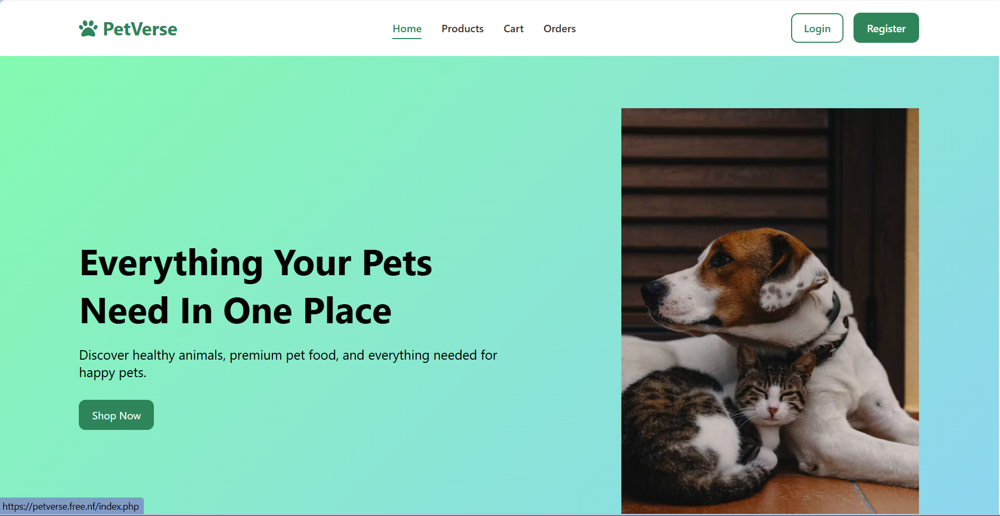
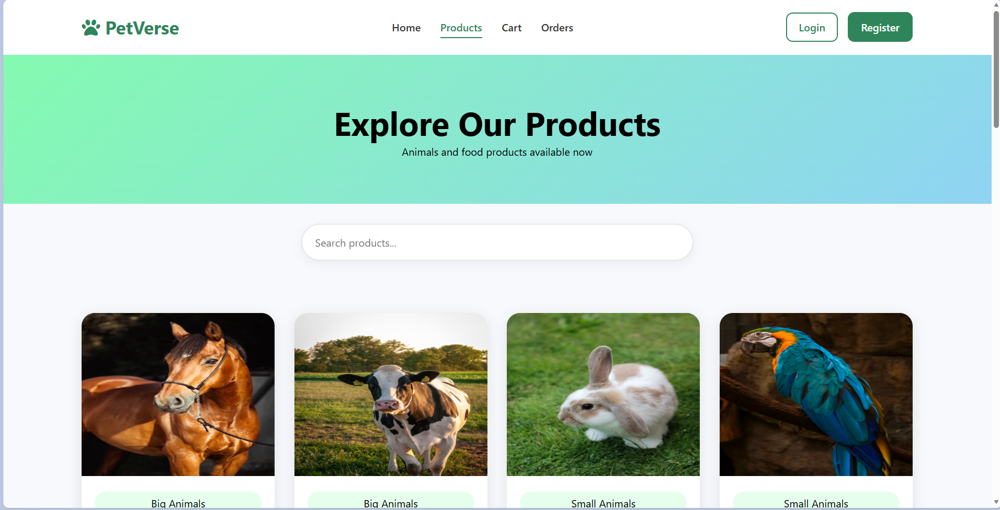
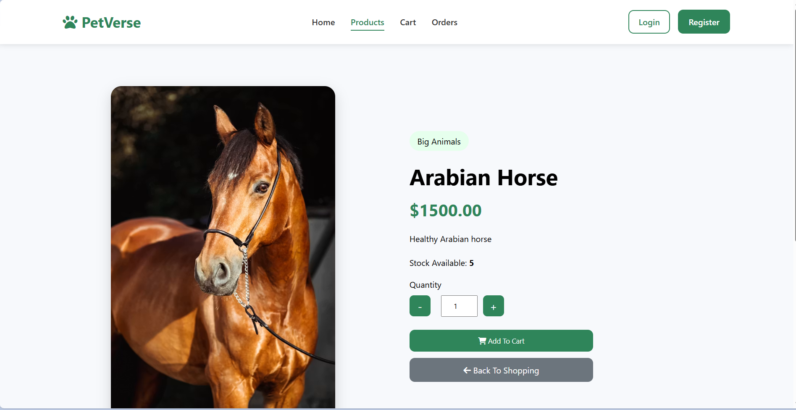
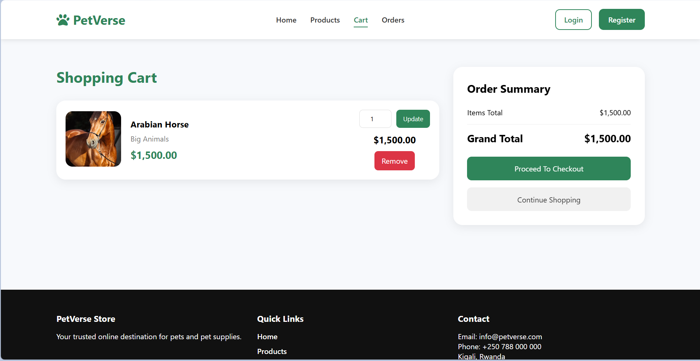
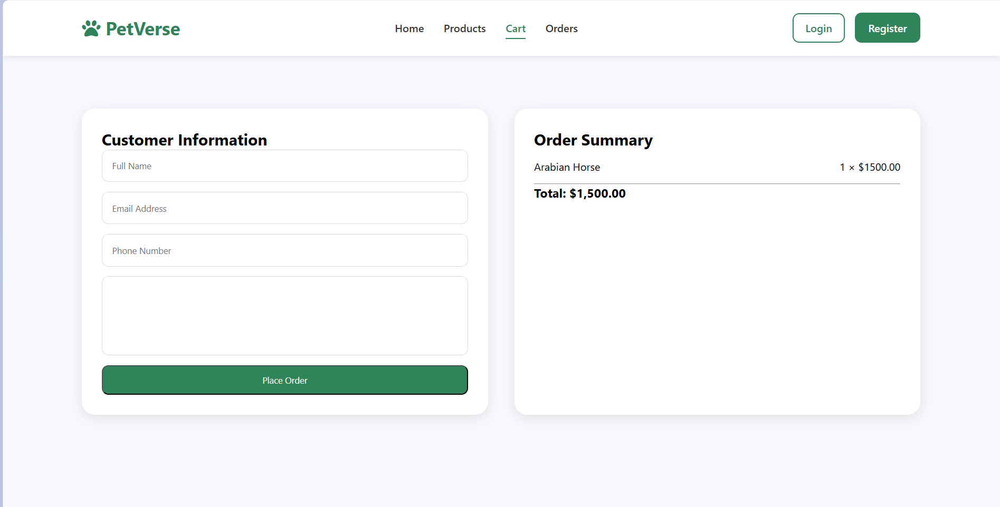
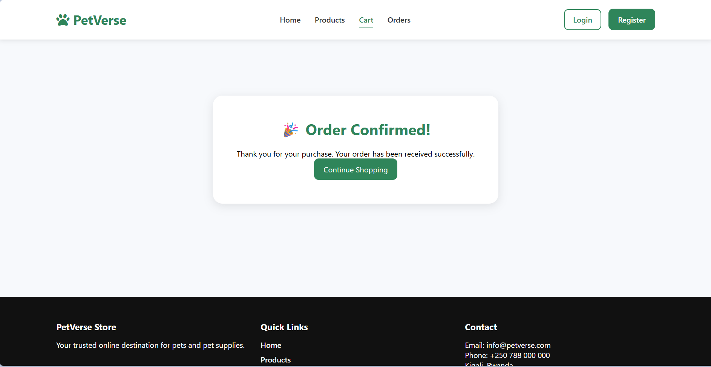
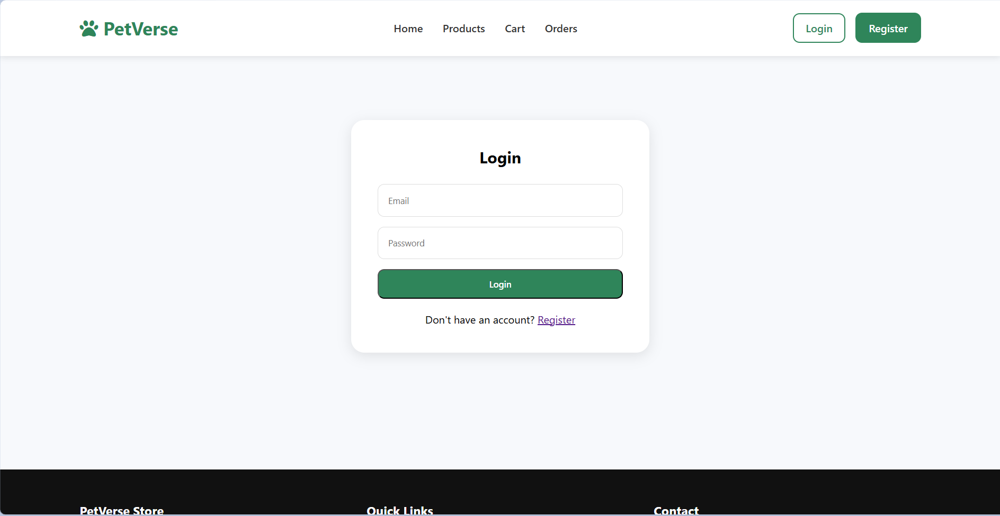
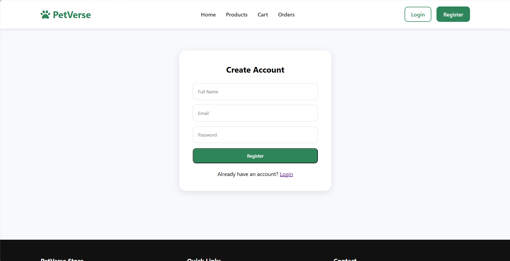
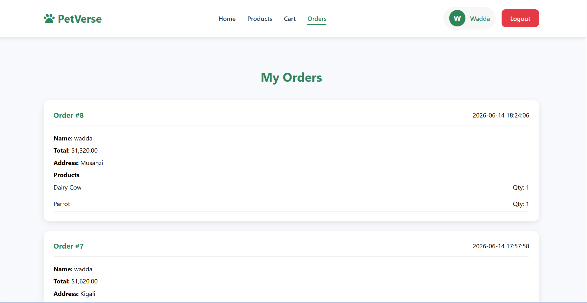
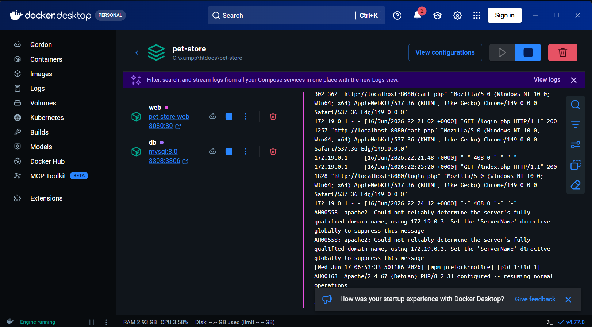

# PetVerse - E-Commerce Web Application

## Project Overview

PetVerse is a modern e-commerce web application developed for selling pet products online. The system allows customers to browse products, view product details, add products to a shopping cart, place orders, and manage their purchases through an easy-to-use and responsive interface.

This project was developed as the final project for the **EWA408510 – E-Commerce and Web Application** course at the **University of Lay Adventists of Kigali (UNILAK)**.

---

# Features

### Customer Features

* Responsive homepage
* Product listing
* Product categories
* Product details page
* Shopping cart
* Update cart quantities
* Remove items from cart
* User registration
* User login/logout
* Secure checkout process
* Order confirmation
* My Orders page

### Technical Features

* Responsive web design
* PHP & MySQL backend
* Docker containerization
* GitHub version control
* GitHub Actions CI/CD pipeline
* Automatic deployment to InfinityFree via FTP

---

# Technologies Used

| Technology     | Purpose                                        |
| -------------- | ---------------------------------------------- |
| HTML5          | Page Structure                                 |
| CSS3           | Styling                                        |
| JavaScript     | Client-side Interactivity                      |
| PHP            | Backend Development                            |
| MySQL          | Database                                       |
| Docker         | Containerization                               |
| Docker Compose | Multi-container Management                     |
| Git            | Version Control                                |
| GitHub         | Source Code Hosting                            |
| GitHub Actions | Continuous Integration & Continuous Deployment |
| InfinityFree   | Web Hosting                                    |

---

# Project Structure

```text
PET-STORE/
│
├── .github/
│   └── workflows/
│       ├── ci.yml
│       └── cd.yml
├── assets/
│   ├── css/
│   ├── images/
│   └── js/
├── includes/
├── database.sql
├── Dockerfile
├── docker-compose.yml
├── index.php
├── products.php
├── cart.php
├── checkout.php
├── login.php
├── register.php
└── README.md
```

---

# Installation

## Clone the Repository

```bash
git clone https://github.com/mazinmohd/pet-store.git
```

## Move into the Project

```bash
cd PET-STORE
```

## Start Docker

```bash
docker compose up --build
```

## Open in Browser

```
http://localhost:8080
```

---

# Docker

This project is fully containerized using Docker.

Files included:

* Dockerfile
* docker-compose.yml

Run the application using:

```bash
docker compose up --build
```

---

# CI/CD Pipeline

The project uses **GitHub Actions** for Continuous Integration and Continuous Deployment.

### Continuous Integration (CI)

On every push to the **main** branch:

* Checkout repository
* Build Docker image
* Run Docker container
* Verify successful execution
* Stop and remove container

### Continuous Deployment (CD)

After a successful CI workflow:

* Connect to InfinityFree via FTP
* Upload updated project files automatically
* Deploy the latest version of the application

---

# Database

The application uses a MySQL database containing tables such as:

* Users
* Order_items
* Orders
* Products

Database script:

```
database.sql
```

---

# Screenshots

## Homepage



## Products Page



## Product Details



## Shopping Cart



## Checkout



## Order Success



## Login



## Register



## My Orders



## Docker Container Running




# Deployment

Live Website:

**https://petverse.free.nf**

---

# GitHub Repository

**https://github.com/mazinmohd/pet-store**

---

# Future Improvements

* Online payment integration (Stripe/PayPal)
* Product search and filtering
* Wishlist functionality
* Product reviews and ratings
* Admin dashboard
* Email notifications
* AI-powered product recommendations

---

# Author

**Mazen Mohammed**

Faculty of Computing and Information Sciences

University of Lay Adventists of Kigali (UNILAK)

Academic Year: 2025–2026

---
